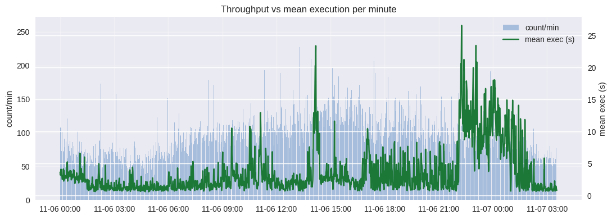

# ETA Performance Verification 

## Source of Truth Notebook

**Created:** 2025-11-08

This notebook is a **source of truth** for validating the performance degradation claim and for producing reproducible anomaly/attribution outputs from `cleaned_eta_logs.csv`.

> The original dataset was collected from raw logs in `time.txt` and `time6.txt`. It has been cleaned (normalizing fields) and time ordered to ensure accurate analysis. 

> **Data file SHA256:** `b7c4fe3646d472cf92b9221abd54302fb82712f5969e9dabb942b2f459dabacd`

### Windows used in verification:

**Baseline:** 2025-11-06 21:30 → 22:00
**Peak:** 2025-11-06 22:20 → 23:10


## Environment & Requirements

- Python 3.9+
- `pandas`, `matplotlib`
- (Optional) `seaborn` for prettier plots

> All charts are generated with `matplotlib`; no internet access is required.


```python

import pandas as pd
import numpy as np
import matplotlib.pyplot as plt
from matplotlib.dates import DateFormatter
from datetime import datetime
import hashlib, platform, json

plt.style.use('seaborn-v0_8')
pd.options.display.max_rows = 50

CSV_PATH = 'cleaned_eta_logs.csv'

# Lock to dataset hash (for audit trail)
sha = hashlib.sha256(open(CSV_PATH,'rb').read()).hexdigest()
print('Dataset:', CSV_PATH)
print('SHA256 :', sha)
print('Python :', platform.python_version())
print('Pandas :', pd.__version__)

```

    Dataset: cleaned_eta_logs.csv
    SHA256 : b7c4fe3646d472cf92b9221abd54302fb82712f5969e9dabb942b2f459dabacd
    Python : 3.12.11
    Pandas : 2.2.3


# Load data


```python
df = pd.read_csv(CSV_PATH)
assert 'datetime' in df.columns and 'execution_time' in df.columns, 'CSV must contain datetime and execution_time columns'

df['datetime'] = pd.to_datetime(df['datetime'])
# Normalize boolean flags if present
for col in ['is_slow','is_very_slow','is_critical']:
    if col in df.columns and df[col].dtype != bool:
        df[col] = df[col].astype(str).str.lower().map({'true':True,'false':False})

print('Rows   :', len(df))
print('Start  :', df['datetime'].min())
print('End    :', df['datetime'].max())
print('Agents :', df['agent_type'].nunique(), sorted(df['agent_type'].unique()))

```

    Rows   : 158186
    Start  : 2025-11-06 00:00:00.850000
    End    : 2025-11-07 03:33:49.509000
    Agents : 2 ['eta_agent', 'eta_iagent']


# Parameters — Baseline/Peak Windows (inclusive start, exclusive end)


```python
baseline_start = datetime(2025, 11, 6, 21, 30)
baseline_end   = datetime(2025, 11, 6, 22, 0)
peak_start     = datetime(2025, 11, 6, 22, 20)
peak_end       = datetime(2025, 11, 6, 23, 10)

print('Baseline :', baseline_start, '->', baseline_end)
print('Peak     :', peak_start, '->', peak_end)

```

    Baseline : 2025-11-06 21:30:00 -> 2025-11-06 22:00:00
    Peak     : 2025-11-06 22:20:00 -> 2025-11-06 23:10:00


# Verification | Baseline vs Peak


```python
baseline = df[(df['datetime'] >= baseline_start) & (df['datetime'] < baseline_end)]
peak     = df[(df['datetime'] >= peak_start)     & (df['datetime'] < peak_end)]

print(f'Baseline count: {len(baseline):,}')
print(f'Peak count    : {len(peak):,}')

def stats(s: pd.DataFrame):
    return {
        'count': int(len(s)),
        'time_min': str(s['datetime'].min()),
        'time_max': str(s['datetime'].max()),
        'mean': float(s['execution_time'].mean()),
        'median': float(s['execution_time'].median()),
        'p95': float(s['execution_time'].quantile(0.95)),
        'std': float(s['execution_time'].std(ddof=0)),  # population std to match earlier runs
        'min': float(s['execution_time'].min()),
        'max': float(s['execution_time'].max()),
        'slow_pct_gt20': float((s['execution_time'] > 20).mean() * 100.0),
        'critical_pct_gt60': float((s['execution_time'] > 60).mean() * 100.0),
    }

b = stats(baseline)
p = stats(peak)

print("\nBaseline metrics:")
print(json.dumps(b, indent=2))

print("\nPeak metrics:")
print(json.dumps(p, indent=2))

slowdown = p['mean'] / b['mean'] if b['mean'] else np.nan
increase = ((p['mean'] - b['mean']) / b['mean'] * 100.0) if b['mean'] else np.nan

print(f"\nSlowdown factor (mean): {slowdown:.2f}x")
print(f"Increase vs baseline : {increase:.2f}%")

# Persist exact results for reports
verification = {
    'baseline_window': {'start': str(baseline_start), 'end': str(baseline_end)},
    'peak_window': {'start': str(peak_start), 'end': str(peak_end)},
    'baseline': b,
    'peak': p,
    'slowdown_factor_mean': round(float(slowdown), 3) if np.isfinite(slowdown) else None,
    'increase_percent_mean': round(float(increase), 2) if np.isfinite(increase) else None,
    'dataset_sha256': sha,  # assumes 'sha' was set earlier when you hashed the CSV
}
#with open('artifact_verification_case.json', 'w') as f:
 #   f.write(json.dumps(verification, indent=2))
#print("\nSaved -> artifact_verification_case.json")

```

    Baseline count: 2,756
    Peak count    : 4,708
    
    Baseline metrics:
    {
      "count": 2756,
      "time_min": "2025-11-06 21:30:04.074000",
      "time_max": "2025-11-06 21:59:59.654000",
      "mean": 2.0268011611030476,
      "median": 0.901,
      "p95": 7.3420000000000005,
      "std": 2.879717509468294,
      "min": 0.027,
      "max": 34.083,
      "slow_pct_gt20": 0.39912917271407833,
      "critical_pct_gt60": 0.0
    }
    
    Peak metrics:
    {
      "count": 4708,
      "time_min": "2025-11-06 22:20:00.187000",
      "time_max": "2025-11-06 23:09:59.259000",
      "mean": 13.186807986406118,
      "median": 11.792,
      "p95": 35.74714999999994,
      "std": 13.158711419893468,
      "min": 0.021,
      "max": 115.895,
      "slow_pct_gt20": 16.90739167374681,
      "critical_pct_gt60": 1.6992353440951573
    }
    
    Slowdown factor (mean): 6.51x
    Increase vs baseline : 550.62%


# Attribution — by agent & top PIDs during peak


```python
by_agent_base = baseline.groupby('agent_type').execution_time.agg(
    count='size', mean='mean', median='median', p95=lambda s: s.quantile(0.95), max='max'
)
by_agent_peak = peak.groupby('agent_type').execution_time.agg(
    count='size', mean='mean', median='median', p95=lambda s: s.quantile(0.95), max='max'
)

display(by_agent_base.round(3))
display(by_agent_peak.round(3))

peak2 = peak.copy()
peak2['exec_time'] = peak2['execution_time']
pid_contrib = peak2.groupby(['agent_type','pid']).agg(
    count=('exec_time','size'),
    mean=('exec_time','mean'),
    sum_exec=('exec_time','sum'),
    max=('exec_time','max')
).sort_values('sum_exec', ascending=False)

display(pid_contrib.head(10).round(3))

by_agent_base.round(3).to_csv('artifact_baseline_by_agent.csv')
by_agent_peak.round(3).to_csv('artifact_peak_by_agent.csv')
pid_contrib.round(3).to_csv('artifact_peak_top_pid.csv')
print('Saved -> artifact_baseline_by_agent.csv, artifact_peak_by_agent.csv, artifact_peak_top_pid.csv')

```


<div>
<style scoped>
    .dataframe tbody tr th:only-of-type {
        vertical-align: middle;
    }

    .dataframe tbody tr th {
        vertical-align: top;
    }

    .dataframe thead th {
        text-align: right;
    }
</style>
<table border="1" class="dataframe">
  <thead>
    <tr style="text-align: right;">
      <th></th>
      <th>count</th>
      <th>mean</th>
      <th>median</th>
      <th>p95</th>
      <th>max</th>
    </tr>
    <tr>
      <th>agent_type</th>
      <th></th>
      <th></th>
      <th></th>
      <th></th>
      <th></th>
    </tr>
  </thead>
  <tbody>
    <tr>
      <th>eta_agent</th>
      <td>2572</td>
      <td>2.081</td>
      <td>0.895</td>
      <td>7.400</td>
      <td>34.083</td>
    </tr>
    <tr>
      <th>eta_iagent</th>
      <td>184</td>
      <td>1.271</td>
      <td>0.917</td>
      <td>4.213</td>
      <td>9.347</td>
    </tr>
  </tbody>
</table>
</div>


<div>
<style scoped>
    .dataframe tbody tr th:only-of-type {
        vertical-align: middle;
    }

    .dataframe tbody tr th {
        vertical-align: top;
    }

    .dataframe thead th {
        text-align: right;
    }
</style>
<table border="1" class="dataframe">
  <thead>
    <tr style="text-align: right;">
      <th></th>
      <th>count</th>
      <th>mean</th>
      <th>median</th>
      <th>p95</th>
      <th>max</th>
    </tr>
    <tr>
      <th>agent_type</th>
      <th></th>
      <th></th>
      <th></th>
      <th></th>
      <th></th>
    </tr>
  </thead>
  <tbody>
    <tr>
      <th>eta_agent</th>
      <td>4587</td>
      <td>13.267</td>
      <td>11.737</td>
      <td>36.308</td>
      <td>115.895</td>
    </tr>
    <tr>
      <th>eta_iagent</th>
      <td>121</td>
      <td>10.159</td>
      <td>13.136</td>
      <td>13.335</td>
      <td>13.978</td>
    </tr>
  </tbody>
</table>
</div>


<div>
<style scoped>
    .dataframe tbody tr th:only-of-type {
        vertical-align: middle;
    }

    .dataframe tbody tr th {
        vertical-align: top;
    }

    .dataframe thead th {
        text-align: right;
    }
</style>
<table border="1" class="dataframe">
  <thead>
    <tr style="text-align: right;">
      <th></th>
      <th></th>
      <th>count</th>
      <th>mean</th>
      <th>sum_exec</th>
      <th>max</th>
    </tr>
    <tr>
      <th>agent_type</th>
      <th>pid</th>
      <th></th>
      <th></th>
      <th></th>
      <th></th>
    </tr>
  </thead>
  <tbody>
    <tr>
      <th rowspan="10" valign="top">eta_agent</th>
      <th>7963</th>
      <td>90</td>
      <td>14.311</td>
      <td>1287.971</td>
      <td>74.171</td>
    </tr>
    <tr>
      <th>7765</th>
      <td>81</td>
      <td>15.012</td>
      <td>1215.934</td>
      <td>89.060</td>
    </tr>
    <tr>
      <th>8099</th>
      <td>78</td>
      <td>14.705</td>
      <td>1146.974</td>
      <td>71.232</td>
    </tr>
    <tr>
      <th>7985</th>
      <td>76</td>
      <td>14.893</td>
      <td>1131.898</td>
      <td>91.333</td>
    </tr>
    <tr>
      <th>7864</th>
      <td>95</td>
      <td>11.677</td>
      <td>1109.321</td>
      <td>60.411</td>
    </tr>
    <tr>
      <th>7694</th>
      <td>82</td>
      <td>13.458</td>
      <td>1103.517</td>
      <td>77.639</td>
    </tr>
    <tr>
      <th>7769</th>
      <td>78</td>
      <td>14.087</td>
      <td>1098.795</td>
      <td>73.434</td>
    </tr>
    <tr>
      <th>7763</th>
      <td>78</td>
      <td>14.084</td>
      <td>1098.550</td>
      <td>88.380</td>
    </tr>
    <tr>
      <th>8109</th>
      <td>85</td>
      <td>12.834</td>
      <td>1090.877</td>
      <td>81.274</td>
    </tr>
    <tr>
      <th>7851</th>
      <td>83</td>
      <td>13.127</td>
      <td>1089.526</td>
      <td>68.991</td>
    </tr>
  </tbody>
</table>
</div>


    Saved -> artifact_baseline_by_agent.csv, artifact_peak_by_agent.csv, artifact_peak_top_pid.csv


# Per-minute p95 anomalies with robust z-score


```python
# Aggregate per minute
per_min = df.copy()
per_min['minute_ts'] = per_min['datetime'].dt.floor('min')
agg = per_min.groupby('minute_ts').agg(
    n=('execution_time','size'),
    mean_exec=('execution_time','mean'),
    p95_exec=('execution_time', lambda s: s.quantile(0.95)),
    max_exec=('execution_time','max')
)

# Robust z on p95
med = agg['p95_exec'].median()
mad = (agg['p95_exec']-med).abs().median()
agg['robust_z'] = 0 if mad==0 else 0.6745*(agg['p95_exec']-med)/mad

anoms = agg[agg['robust_z']>3].sort_values('p95_exec', ascending=False)
print(f"Anomalous minutes (robust_z>3): {len(anoms)}")
display(anoms.head(20).round(3))

anoms.round(4).to_csv('artifact_anomalous_minutes.csv')
print('Saved -> artifact_anomalous_minutes.csv')

# Plots
fig, ax = plt.subplots(figsize=(11,4))
ax.plot(agg.index, agg['p95_exec'], color='#2b8cbe', lw=1.5, label='per-minute p95')
if not anoms.empty:
    ax.scatter(anoms.index, anoms['p95_exec'], color='red', s=12, label='anomaly (z>3)')
ax.set_title('Per-minute p95 execution time')
ax.set_ylabel('seconds')
ax.legend(loc='upper left')
ax.xaxis.set_major_formatter(DateFormatter('%m-%d %H:%M'))
ax.grid(True, alpha=0.3)
plt.tight_layout()
plt.show()

# Throughput vs mean exec per minute
fig, ax1 = plt.subplots(figsize=(11,4))
ax1.bar(agg.index, agg['n'], width=0.0006, color='#a6bddb', label='count/min')
ax1.set_ylabel('count/min')
ax2 = ax1.twinx()
ax2.plot(agg.index, agg['mean_exec'], color='#1b7837', label='mean exec (s)')
ax2.set_ylabel('mean exec (s)')
ax1.set_title('Throughput vs mean execution per minute')
ax1.xaxis.set_major_formatter(DateFormatter('%m-%d %H:%M'))
# unify legend
handles1, labels1 = ax1.get_legend_handles_labels()
handles2, labels2 = ax2.get_legend_handles_labels()
ax1.legend(handles1+handles2, labels1+labels2, loc='upper right')
ax1.grid(True, alpha=0.3)
plt.tight_layout()
plt.show()

```

    Anomalous minutes (robust_z>3): 202


<div>
<style scoped>
    .dataframe tbody tr th:only-of-type {
        vertical-align: middle;
    }

    .dataframe tbody tr th {
        vertical-align: top;
    }

    .dataframe thead th {
        text-align: right;
    }
</style>
<table border="1" class="dataframe">
  <thead>
    <tr style="text-align: right;">
      <th></th>
      <th>n</th>
      <th>mean_exec</th>
      <th>p95_exec</th>
      <th>max_exec</th>
      <th>robust_z</th>
    </tr>
    <tr>
      <th>minute_ts</th>
      <th></th>
      <th></th>
      <th></th>
      <th></th>
      <th></th>
    </tr>
  </thead>
  <tbody>
    <tr>
      <th>2025-11-06 22:16:00</th>
      <td>110</td>
      <td>26.574</td>
      <td>96.951</td>
      <td>101.467</td>
      <td>20.939</td>
    </tr>
    <tr>
      <th>2025-11-06 22:25:00</th>
      <td>141</td>
      <td>19.255</td>
      <td>86.422</td>
      <td>115.895</td>
      <td>18.521</td>
    </tr>
    <tr>
      <th>2025-11-06 23:04:00</th>
      <td>120</td>
      <td>23.431</td>
      <td>81.593</td>
      <td>104.868</td>
      <td>17.412</td>
    </tr>
    <tr>
      <th>2025-11-06 22:55:00</th>
      <td>106</td>
      <td>19.970</td>
      <td>74.429</td>
      <td>89.837</td>
      <td>15.767</td>
    </tr>
    <tr>
      <th>2025-11-06 22:14:00</th>
      <td>94</td>
      <td>20.589</td>
      <td>67.076</td>
      <td>88.746</td>
      <td>14.078</td>
    </tr>
    <tr>
      <th>2025-11-06 14:11:00</th>
      <td>133</td>
      <td>23.384</td>
      <td>66.731</td>
      <td>119.153</td>
      <td>13.999</td>
    </tr>
    <tr>
      <th>2025-11-06 22:17:00</th>
      <td>96</td>
      <td>20.432</td>
      <td>64.561</td>
      <td>97.560</td>
      <td>13.500</td>
    </tr>
    <tr>
      <th>2025-11-06 23:36:00</th>
      <td>93</td>
      <td>16.702</td>
      <td>64.156</td>
      <td>76.407</td>
      <td>13.407</td>
    </tr>
    <tr>
      <th>2025-11-06 22:24:00</th>
      <td>116</td>
      <td>21.240</td>
      <td>62.708</td>
      <td>91.333</td>
      <td>13.075</td>
    </tr>
    <tr>
      <th>2025-11-06 22:34:00</th>
      <td>120</td>
      <td>16.265</td>
      <td>56.676</td>
      <td>81.901</td>
      <td>11.690</td>
    </tr>
    <tr>
      <th>2025-11-07 00:02:00</th>
      <td>99</td>
      <td>18.015</td>
      <td>53.042</td>
      <td>89.643</td>
      <td>10.855</td>
    </tr>
    <tr>
      <th>2025-11-06 23:08:00</th>
      <td>106</td>
      <td>16.671</td>
      <td>52.577</td>
      <td>80.853</td>
      <td>10.748</td>
    </tr>
    <tr>
      <th>2025-11-07 00:08:00</th>
      <td>121</td>
      <td>16.808</td>
      <td>50.572</td>
      <td>92.071</td>
      <td>10.288</td>
    </tr>
    <tr>
      <th>2025-11-06 22:38:00</th>
      <td>82</td>
      <td>14.076</td>
      <td>50.176</td>
      <td>80.834</td>
      <td>10.197</td>
    </tr>
    <tr>
      <th>2025-11-07 01:26:00</th>
      <td>78</td>
      <td>14.083</td>
      <td>50.162</td>
      <td>60.206</td>
      <td>10.194</td>
    </tr>
    <tr>
      <th>2025-11-06 23:06:00</th>
      <td>89</td>
      <td>19.531</td>
      <td>48.205</td>
      <td>76.140</td>
      <td>9.744</td>
    </tr>
    <tr>
      <th>2025-11-06 23:22:00</th>
      <td>83</td>
      <td>13.955</td>
      <td>46.904</td>
      <td>70.129</td>
      <td>9.445</td>
    </tr>
    <tr>
      <th>2025-11-06 14:09:00</th>
      <td>159</td>
      <td>20.284</td>
      <td>46.755</td>
      <td>104.919</td>
      <td>9.411</td>
    </tr>
    <tr>
      <th>2025-11-06 14:10:00</th>
      <td>157</td>
      <td>20.143</td>
      <td>46.632</td>
      <td>116.548</td>
      <td>9.383</td>
    </tr>
    <tr>
      <th>2025-11-06 23:02:00</th>
      <td>84</td>
      <td>14.994</td>
      <td>46.379</td>
      <td>58.246</td>
      <td>9.325</td>
    </tr>
  </tbody>
</table>
</div>


    Saved -> artifact_anomalous_minutes.csv


    

    


    

    


# Top 50 slowest transactions (for breadcrumbs)


```python
slow50 = df.nlargest(50, 'execution_time')[['datetime','agent_type','pid','transaction_id','execution_time']]
display(slow50)
slow50.to_csv('artifact_top50_outliers.csv', index=False)
print('Saved -> artifact_top50_outliers.csv')

```


<div>
<style scoped>
    .dataframe tbody tr th:only-of-type {
        vertical-align: middle;
    }

    .dataframe tbody tr th {
        vertical-align: top;
    }

    .dataframe thead th {
        text-align: right;
    }
</style>
<table border="1" class="dataframe">
  <thead>
    <tr style="text-align: right;">
      <th></th>
      <th>datetime</th>
      <th>agent_type</th>
      <th>pid</th>
      <th>transaction_id</th>
      <th>execution_time</th>
    </tr>
  </thead>
  <tbody>
    <tr>
      <th>75478</th>
      <td>2025-11-06 14:11:30.472</td>
      <td>eta_agent</td>
      <td>8079</td>
      <td>11017738838699</td>
      <td>119.153</td>
    </tr>
    <tr>
      <th>75477</th>
      <td>2025-11-06 14:11:30.345</td>
      <td>eta_agent</td>
      <td>7695</td>
      <td>11017738838700</td>
      <td>118.847</td>
    </tr>
    <tr>
      <th>75521</th>
      <td>2025-11-06 14:11:48.334</td>
      <td>eta_agent</td>
      <td>7861</td>
      <td>11017738845216</td>
      <td>116.820</td>
    </tr>
    <tr>
      <th>75269</th>
      <td>2025-11-06 14:10:00.965</td>
      <td>eta_agent</td>
      <td>7985</td>
      <td>11017738837744</td>
      <td>116.548</td>
    </tr>
    <tr>
      <th>75292</th>
      <td>2025-11-06 14:10:09.804</td>
      <td>eta_agent</td>
      <td>8023</td>
      <td>11017738837829</td>
      <td>116.202</td>
    </tr>
    <tr>
      <th>132539</th>
      <td>2025-11-06 22:25:27.583</td>
      <td>eta_agent</td>
      <td>7860</td>
      <td>11017739576934</td>
      <td>115.895</td>
    </tr>
    <tr>
      <th>132523</th>
      <td>2025-11-06 22:25:19.082</td>
      <td>eta_agent</td>
      <td>7865</td>
      <td>11017739585840</td>
      <td>115.341</td>
    </tr>
    <tr>
      <th>132516</th>
      <td>2025-11-06 22:25:17.486</td>
      <td>eta_agent</td>
      <td>7766</td>
      <td>11017739585838</td>
      <td>113.754</td>
    </tr>
    <tr>
      <th>131870</th>
      <td>2025-11-06 22:18:33.653</td>
      <td>eta_agent</td>
      <td>7844</td>
      <td>11017739567853</td>
      <td>111.335</td>
    </tr>
    <tr>
      <th>75535</th>
      <td>2025-11-06 14:11:53.472</td>
      <td>eta_agent</td>
      <td>8097</td>
      <td>11017738840609</td>
      <td>109.637</td>
    </tr>
    <tr>
      <th>75110</th>
      <td>2025-11-06 14:09:03.299</td>
      <td>eta_agent</td>
      <td>7692</td>
      <td>11017738837247</td>
      <td>104.919</td>
    </tr>
    <tr>
      <th>136159</th>
      <td>2025-11-06 23:04:43.702</td>
      <td>eta_agent</td>
      <td>8087</td>
      <td>11017739623549</td>
      <td>104.868</td>
    </tr>
    <tr>
      <th>132493</th>
      <td>2025-11-06 22:25:06.828</td>
      <td>eta_agent</td>
      <td>8097</td>
      <td>11017739576894</td>
      <td>103.067</td>
    </tr>
    <tr>
      <th>132492</th>
      <td>2025-11-06 22:25:06.621</td>
      <td>eta_agent</td>
      <td>7692</td>
      <td>11017739576896</td>
      <td>102.766</td>
    </tr>
    <tr>
      <th>131702</th>
      <td>2025-11-06 22:16:51.930</td>
      <td>eta_agent</td>
      <td>8144</td>
      <td>11017739567163</td>
      <td>101.467</td>
    </tr>
    <tr>
      <th>131701</th>
      <td>2025-11-06 22:16:51.861</td>
      <td>eta_agent</td>
      <td>7763</td>
      <td>11017739570903</td>
      <td>101.445</td>
    </tr>
    <tr>
      <th>131700</th>
      <td>2025-11-06 22:16:50.974</td>
      <td>eta_agent</td>
      <td>8025</td>
      <td>11017739570902</td>
      <td>100.560</td>
    </tr>
    <tr>
      <th>131632</th>
      <td>2025-11-06 22:16:13.654</td>
      <td>eta_agent</td>
      <td>7961</td>
      <td>11017739566904</td>
      <td>98.679</td>
    </tr>
    <tr>
      <th>131696</th>
      <td>2025-11-06 22:16:48.857</td>
      <td>eta_agent</td>
      <td>8098</td>
      <td>11017739570900</td>
      <td>98.476</td>
    </tr>
    <tr>
      <th>132482</th>
      <td>2025-11-06 22:25:01.631</td>
      <td>eta_agent</td>
      <td>7852</td>
      <td>11017739585836</td>
      <td>97.909</td>
    </tr>
    <tr>
      <th>131694</th>
      <td>2025-11-06 22:16:48.204</td>
      <td>eta_agent</td>
      <td>8084</td>
      <td>11017739570907</td>
      <td>97.779</td>
    </tr>
    <tr>
      <th>131797</th>
      <td>2025-11-06 22:17:52.292</td>
      <td>eta_agent</td>
      <td>7765</td>
      <td>11017739571263</td>
      <td>97.560</td>
    </tr>
    <tr>
      <th>136144</th>
      <td>2025-11-06 23:04:35.941</td>
      <td>eta_agent</td>
      <td>7850</td>
      <td>11017739623556</td>
      <td>97.034</td>
    </tr>
    <tr>
      <th>136141</th>
      <td>2025-11-06 23:04:35.645</td>
      <td>eta_agent</td>
      <td>7773</td>
      <td>11017739631662</td>
      <td>96.786</td>
    </tr>
    <tr>
      <th>136140</th>
      <td>2025-11-06 23:04:35.569</td>
      <td>eta_agent</td>
      <td>7693</td>
      <td>11017739631661</td>
      <td>96.697</td>
    </tr>
    <tr>
      <th>136136</th>
      <td>2025-11-06 23:04:35.171</td>
      <td>eta_agent</td>
      <td>8084</td>
      <td>11017739618129</td>
      <td>96.265</td>
    </tr>
    <tr>
      <th>131733</th>
      <td>2025-11-06 22:17:10.477</td>
      <td>eta_agent</td>
      <td>7860</td>
      <td>11017739575029</td>
      <td>96.092</td>
    </tr>
    <tr>
      <th>131692</th>
      <td>2025-11-06 22:16:46.321</td>
      <td>eta_agent</td>
      <td>7851</td>
      <td>11017739570904</td>
      <td>95.940</td>
    </tr>
    <tr>
      <th>142148</th>
      <td>2025-11-07 00:04:38.432</td>
      <td>eta_agent</td>
      <td>7764</td>
      <td>11017739713079</td>
      <td>94.825</td>
    </tr>
    <tr>
      <th>75363</th>
      <td>2025-11-06 14:10:34.466</td>
      <td>eta_agent</td>
      <td>8087</td>
      <td>11017738824896</td>
      <td>93.538</td>
    </tr>
    <tr>
      <th>131826</th>
      <td>2025-11-06 22:18:14.373</td>
      <td>eta_agent</td>
      <td>7793</td>
      <td>11017739567841</td>
      <td>93.512</td>
    </tr>
    <tr>
      <th>75462</th>
      <td>2025-11-06 14:11:17.363</td>
      <td>eta_agent</td>
      <td>7773</td>
      <td>11017738838837</td>
      <td>93.439</td>
    </tr>
    <tr>
      <th>131689</th>
      <td>2025-11-06 22:16:43.698</td>
      <td>eta_agent</td>
      <td>7693</td>
      <td>11017739570906</td>
      <td>93.284</td>
    </tr>
    <tr>
      <th>131687</th>
      <td>2025-11-06 22:16:43.306</td>
      <td>eta_agent</td>
      <td>8093</td>
      <td>11017739567164</td>
      <td>92.834</td>
    </tr>
    <tr>
      <th>132488</th>
      <td>2025-11-06 22:25:04.542</td>
      <td>eta_agent</td>
      <td>8098</td>
      <td>11017739576935</td>
      <td>92.686</td>
    </tr>
    <tr>
      <th>131683</th>
      <td>2025-11-06 22:16:42.907</td>
      <td>eta_agent</td>
      <td>7695</td>
      <td>11017739567161</td>
      <td>92.470</td>
    </tr>
    <tr>
      <th>142591</th>
      <td>2025-11-07 00:08:30.616</td>
      <td>eta_agent</td>
      <td>7695</td>
      <td>11017739715152</td>
      <td>92.071</td>
    </tr>
    <tr>
      <th>142504</th>
      <td>2025-11-07 00:07:54.512</td>
      <td>eta_agent</td>
      <td>8079</td>
      <td>11017739714817</td>
      <td>91.945</td>
    </tr>
    <tr>
      <th>132473</th>
      <td>2025-11-06 22:24:55.086</td>
      <td>eta_agent</td>
      <td>7985</td>
      <td>11017739585842</td>
      <td>91.333</td>
    </tr>
    <tr>
      <th>131071</th>
      <td>2025-11-06 22:10:22.331</td>
      <td>eta_agent</td>
      <td>8079</td>
      <td>11017739558865</td>
      <td>91.075</td>
    </tr>
    <tr>
      <th>142193</th>
      <td>2025-11-07 00:04:53.681</td>
      <td>eta_agent</td>
      <td>7785</td>
      <td>11017739713235</td>
      <td>90.879</td>
    </tr>
    <tr>
      <th>135263</th>
      <td>2025-11-06 22:55:00.779</td>
      <td>eta_agent</td>
      <td>8097</td>
      <td>11017739604187</td>
      <td>89.837</td>
    </tr>
    <tr>
      <th>75912</th>
      <td>2025-11-06 14:15:04.911</td>
      <td>eta_agent</td>
      <td>7793</td>
      <td>11017738834903</td>
      <td>89.774</td>
    </tr>
    <tr>
      <th>141829</th>
      <td>2025-11-07 00:02:06.944</td>
      <td>eta_agent</td>
      <td>7764</td>
      <td>11017739701676</td>
      <td>89.643</td>
    </tr>
    <tr>
      <th>131923</th>
      <td>2025-11-06 22:19:01.424</td>
      <td>eta_agent</td>
      <td>7695</td>
      <td>11017739571677</td>
      <td>89.109</td>
    </tr>
    <tr>
      <th>132468</th>
      <td>2025-11-06 22:24:52.949</td>
      <td>eta_agent</td>
      <td>7844</td>
      <td>11017739585845</td>
      <td>89.087</td>
    </tr>
    <tr>
      <th>132467</th>
      <td>2025-11-06 22:24:52.827</td>
      <td>eta_agent</td>
      <td>7765</td>
      <td>11017739585841</td>
      <td>89.060</td>
    </tr>
    <tr>
      <th>136476</th>
      <td>2025-11-06 23:07:56.563</td>
      <td>eta_agent</td>
      <td>7964</td>
      <td>11017739632893</td>
      <td>88.992</td>
    </tr>
    <tr>
      <th>136162</th>
      <td>2025-11-06 23:04:44.339</td>
      <td>eta_agent</td>
      <td>7844</td>
      <td>11017739626506</td>
      <td>88.758</td>
    </tr>
    <tr>
      <th>131521</th>
      <td>2025-11-06 22:14:57.402</td>
      <td>eta_agent</td>
      <td>8084</td>
      <td>11017739549519</td>
      <td>88.746</td>
    </tr>
  </tbody>
</table>
</div>


    Saved -> artifact_top50_outliers.csv


# Summary / machine-readable outputs index


```python
index_payload = {
    'dataset': CSV_PATH,
    'sha256': sha,
    'generated_at': str(datetime.now()),
    'artifacts': [
        'artifact_verification_case.json',
        'artifact_baseline_by_agent.csv',
        'artifact_peak_by_agent.csv',
        'artifact_peak_top_pid.csv',
        'artifact_anomalous_minutes.csv',
        'artifact_top50_outliers.csv'
    ]
}
open('artifact_index.json','w').write(json.dumps(index_payload, indent=2))
print('Saved -> artifact_index.json')

```

    Saved -> artifact_index.json


```python

```
